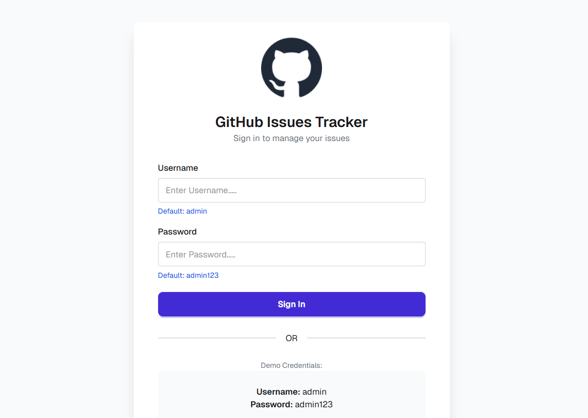

# GitHub Issues Tracker — Issue Management App

A fully functional issue tracking web application with authentication, built using HTML, Tailwind CSS, DaisyUI, and vanilla JavaScript. Features a secure login system, dynamic issue management with real-time DOM manipulation — all without any backend framework.



🔗 **Live Demo:** [https://issue-tracker-bd-01.netlify.app/](https://issue-tracker-bd-01.netlify.app/)  
📁 **Repository:** [github.com/Morshedul-developer/issue-tracker](https://github.com/Morshedul-developer/issue-tracker)

---

## ✨ Features

- Secure login system with credential validation
- Dynamic issue creation, tracking, and management
- Real-time DOM manipulation without any framework
- Clean dashboard UI built with Tailwind CSS & DaisyUI
- ES6+ JavaScript — arrow functions, template literals, spread operator
- Multi-page application (Login + Dashboard)
- Fully responsive across all devices

---

## 🛠️ Tech Stack


---

## 📁 Project Structure

```
issue-tracker/
├── index.html        # Login page
├── main.html         # Dashboard page
├── script/
│   └── app.js
├── assets/
│   └── (images & icons)
└── README.md
```

---

## 🔐 Demo Credentials

```
Username: admin
Password: admin123
```

---

## 🚀 Run Locally

```bash
# Clone the repository
git clone https://github.com/Morshedul-developer/issue-tracker.git

# Open in browser
cd issue-tracker
open index.html
```

---

## 📸 Sections

- **Login Page** — Credential validation with GitHub-themed UI
- **Dashboard** — Issue listing, creation, and management
- **Issue Cards** — Dynamic rendering with DaisyUI components

---

## 📬 Contact

**Morshedul Islam**
- Portfolio: [morshedul-khaer.netlify.app](https://morshedul-khaer.netlify.app)
- GitHub: [@Morshedul-developer](https://github.com/Morshedul-developer)

---

> *"A production-ready issue tracker — built with zero backend, zero framework, just pure JavaScript logic."*
